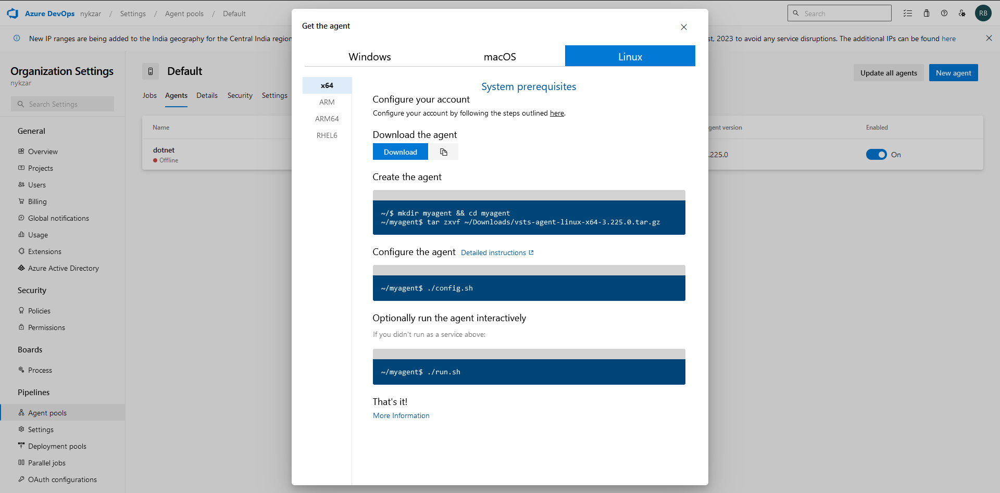
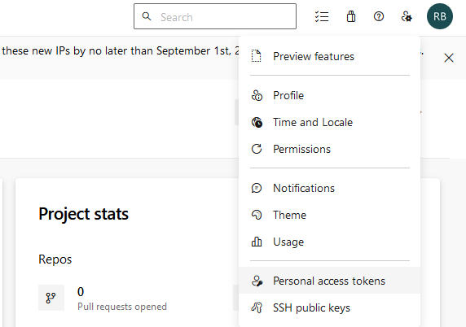
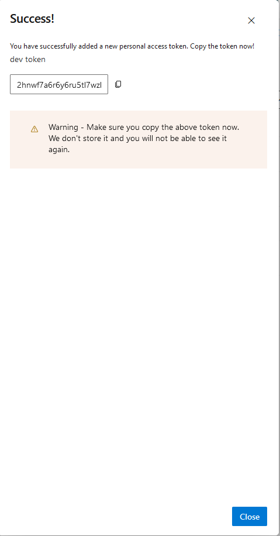

Self hosted (Default) Linux Agent configuration on any server where you want to deploy your application
-------------------------------------------------------------------------------------------------------

* Goto Organization Settings > Agent Pools > Default > Agents > New Agent



* On the Node execute the following commands
```
mkdir myagent && cd myagent
```

* Download the agent
```
~/myagent$ https://vstsagentpackage.azureedge.net/agent/3.225.0/vsts-agent-linux-x64-3.225.0.tar.gz
```
```
~/myagent$ tar zxvf vsts-agent-linux-x64-3.225.0.tar.gz
```

* Before configuring the Agent, we need PAT (personal access token)

* So, head down to 
> User settings > Personal access tokens > New token > enter the token name & Scopes = Full acces > Create



* Note down the PAT as mentioned on the screen



* Be careful while agent configuration & kindly check attaintively for all the prompts 
* Agent configuration 

```
~/myagent$ ./config.sh
```
```
server url = https://dev.azure.com/<azure-username>
```
```
  ___                      ______ _            _ _
 / _ \                     | ___ (_)          | (_)
/ /_\ \_____   _ _ __ ___  | |_/ /_ _ __   ___| |_ _ __   ___  ___
|  _  |_  / | | | '__/ _ \ |  __/| | '_ \ / _ \ | | '_ \ / _ \/ __|
| | | |/ /| |_| | | |  __/ | |   | | |_) |  __/ | | | | |  __/\__ \
\_| |_/___|\__,_|_|  \___| \_|   |_| .__/ \___|_|_|_| |_|\___||___/
                                   | |
        agent v3.225.0             |_|          (commit ef0cd4d)


>> End User License Agreements:

Building sources from a TFVC repository requires accepting the Team Explorer Everywhere End User License Agreement. This step is not required for building sources from Git repositories.

A copy of the Team Explorer Everywhere license agreement can be found at:
  /home/ubuntu/myagent/license.html

Enter (Y/N) Accept the Team Explorer Everywhere license agreement now? (press enter for N) > Y

>> Connect:

Enter server URL > https://dev.azure.com/nykzar
Enter authentication type (press enter for PAT) >
Enter personal access token > *****************************************************
Connecting to server ...

>> Register Agent:

Enter agent pool (press enter for default) >
Enter agent name (press enter for ip-172-31-47-10) > dotnet
Scanning for tool capabilities.
Connecting to the server.
Successfully added the agent
Testing agent connection.
Enter work folder (press enter for _work) >
2023-09-24 07:51:37Z: Settings Saved.
```

* Now the Agent is configured

* Next, let's start the connection
```
~/myagent$ ./run.sh
```

```
Scanning for tool capabilities.
Connecting to the server.
2023-09-24 07:59:56Z: Listening for Jobs
```

### _**[Official Documentation](https://learn.microsoft.com/en-us/azure/devops/pipelines/agents/linux-agent?view=azure-devops){:target="_blank"}**_ 🕵